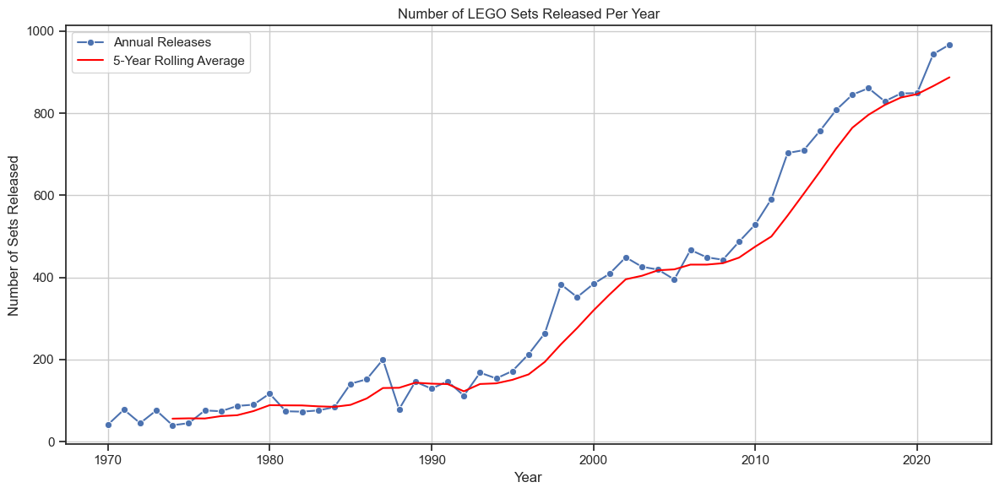
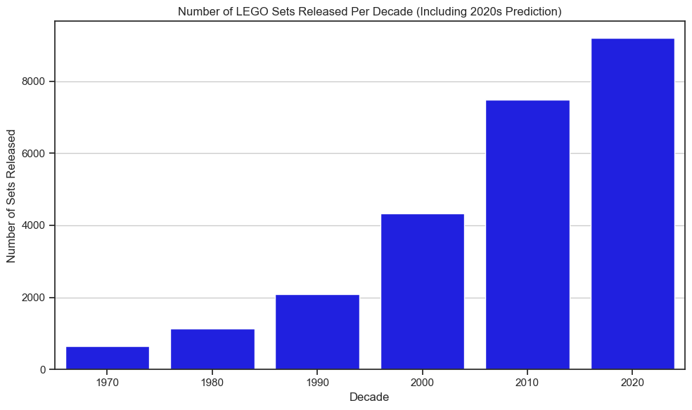
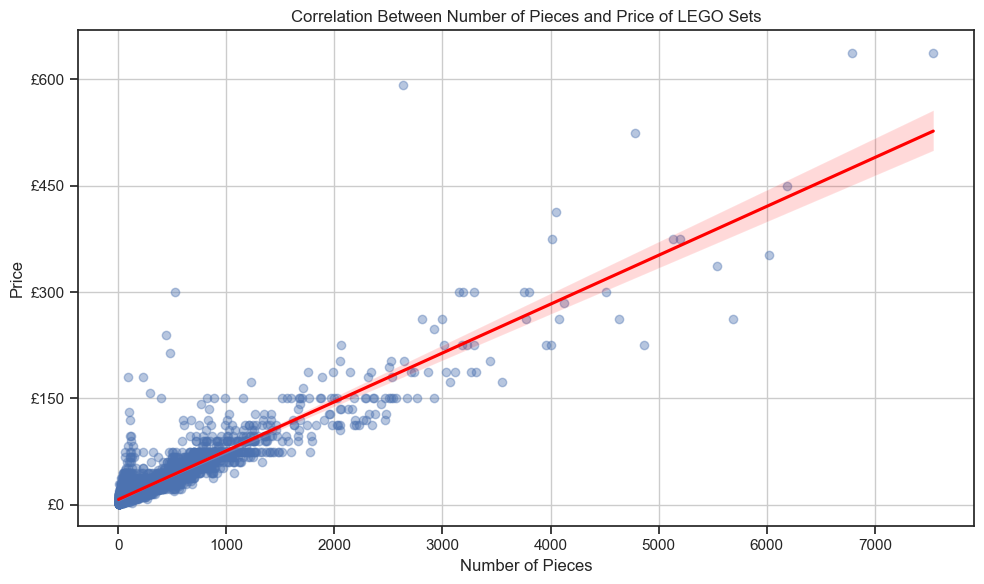
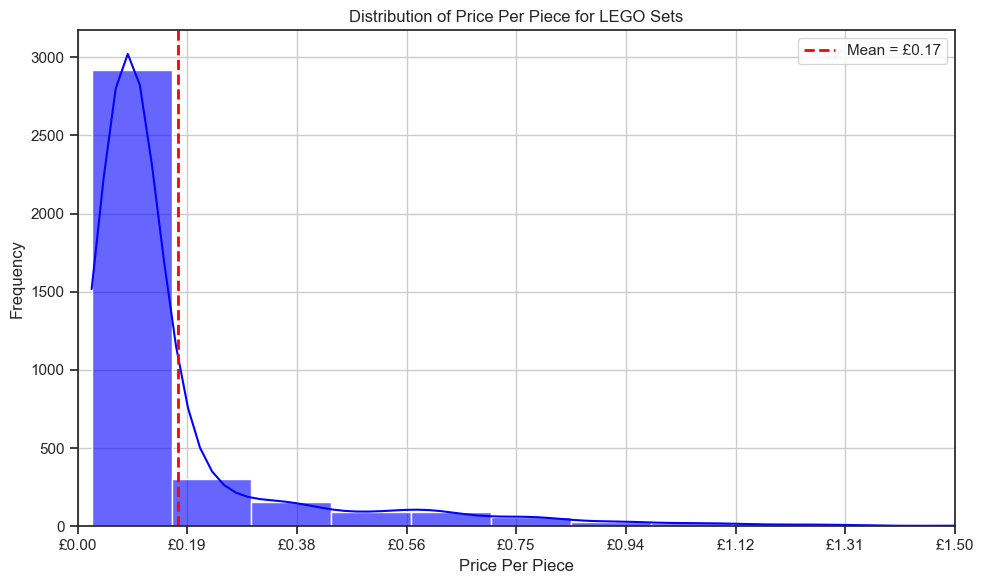
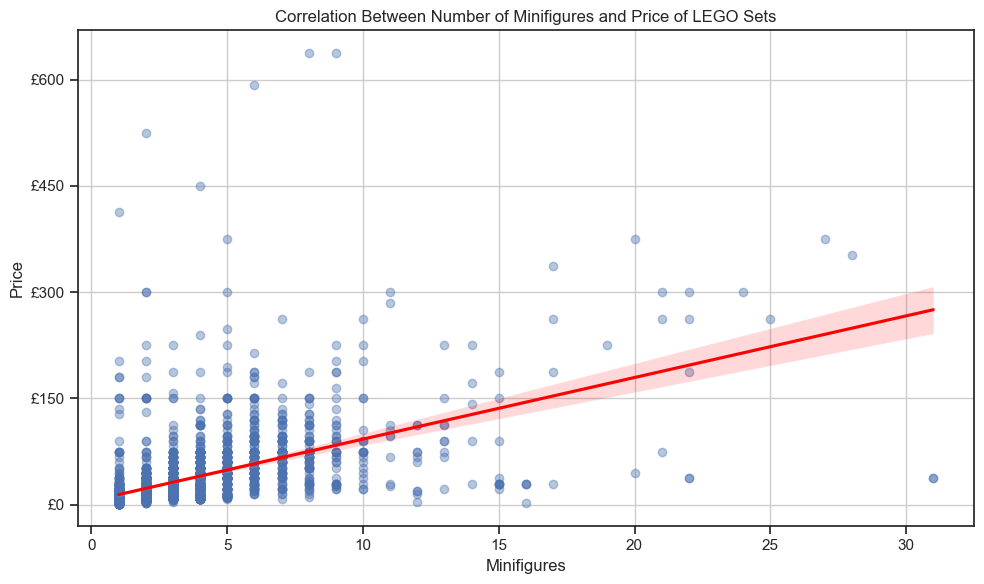
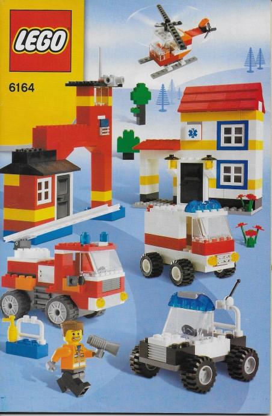
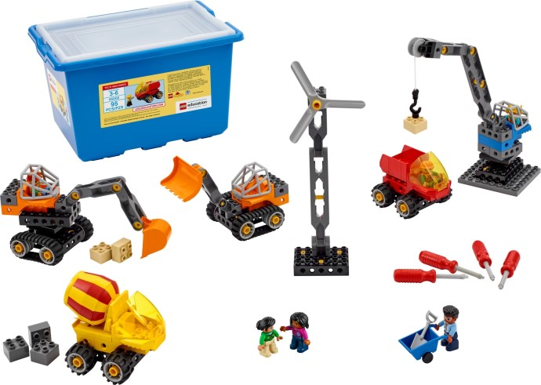

# Overview
Welcome to my analysis of Lego sets from the year 1970-2022. This was a mini project I wanted to do as a refresher for some of the python skills I had learned. Like most kids I enjoyed playing with lego, which is what made this data set stand out to me and began this project. The main aims from this set were to identify trends throughout Lego's lifetime to see how it grew into the giant it is today. The data set includes 18,457 rows of unique lego products, with a wide range of themes spanning from sets based on movies, original Lego sets, and Lego books.

The data set I used can be found at [Maven Analytics](https://mavenanalytics.io/data-playground), it uses data sourced from [Brickset](https://brickset.com). I did do a small amount of cleaning and filtering before the data could be used for this python project. 

The prices in this analysis are originally in USD, which have been converted to GBP at the exchange rate of 1 USD = 0.75 GBP which is accurate as of 09/05/2025 when this was made. Because of this, in the future any prices shown may be inaccurate depending on the current exchange.

# The Questions
Below are some of the questions I wanted to answer in this mini project:

1. How many Lego sets have been released since 1970?
2. What is the relation between the amount of Lego pieces in a set and the price of the set?
3. What theme of lego sets were released the most throughout the different decades?

# Tools I Used
- **Python:** The backbone of the analysis allowing me to find key insights through the use of scripts. Within python I frequently used the following libraries: Pandas, Matplotlib and Seaborn.
- **Jupyter Notebooks:** The tool used to run my python scripts, allowing easy inclusion of notes and analysis.
- **Visual Studio Code:** Also used for executing python scrips
- **Git and Github:** Used for version control and sharing my project.

# Data Preparation and Cleanup
Because I used an already existing data set from Maven Analytics, the data was already cleaned and only a few small changes were needed to prepare it. 

### Libraries I Used
```
import numpy as np
import pandas as pd
from datasets import load_dataset
import matplotlib.pyplot as plt
from matplotlib.ticker import PercentFormatter
from sklearn.linear_model import LinearRegression
from IPython.display import display
import ast
import seaborn as sns
from adjustText import adjust_text
```
### Importing and modifying the data

```
df = pd.read_csv('lego_sets.csv')
df.drop(columns=['bricksetURL', 'thumbnailURL', 'imageURL'], inplace=True)
df['pieces'] = df['pieces'].fillna(0).astype(int)
df['minifigs'] = df['minifigs'].fillna(0).astype(int)
df['year'] = df['year'].astype(int)
df['pieces'] = df['pieces'].astype(int)
df['minifigs'] = df['minifigs'].astype(int)
df['US_retailPrice'] = pd.to_numeric(df['US_retailPrice'], errors='coerce')
df['US_retailPrice'] = df['US_retailPrice'].fillna(0)
df['agerange_min'] = df['agerange_min'].fillna(0)


df_full = df[(df['pieces'] > 0) & (df['minifigs'] > 0) & (df['US_retailPrice'] > 0)].copy()
```

I started off by dropping unnecessary columns that contained URL's for images of the set and links to the Brickset website. The rest of the cleanup was filling missing values, and making sure the different columns of data were in the correct data type for my analysis.
Lastly, I created a new dataframe which only included rows where the pieces, minifigs and US retail price were above 0. This was necessary as many of the oldest Lego sets in the data didn't include those pieces of information, and would end up skewing my findings if included.

# The Analysis

My code and notes for all questions, analysis and notes can be found here:
[Lego_Analysis.ipynb](Lego_Analysis.ipynb).

## 1. How many Lego sets have been released since 1970?
Understanding the number of lego sets released since 1970 offers an insight into the brands growth, production strategy, and the consumer engagement over time. It will give a visualisation as how lego grew from a niche children's toy into the global icon it is today.

To explore this I analysed the total of sets released annually and per decade. I also applied a 5 year rolling average to try and smooth over year to year fluctuations, and included my own prediction for the remaining years of the 2020 decade.

### Visualisation Code
---
```
sns.set_theme(style='ticks')
plt.figure(figsize=(12, 6))
sns.lineplot(data=sets_per_year, x='year', y='set_count', label='Annual Releases', marker='o')
sns.lineplot(data=sets_per_year, x='year', y='rolling_avg', label='5-Year Rolling Average', color='red')
plt.title('Number of LEGO Sets Released Per Year')
plt.xlabel('Year')
plt.ylabel('Number of Sets Released')
plt.grid(True)
plt.legend()
plt.tight_layout()
plt.show()
```
```
plt.figure(figsize=(10, 6))
sns.barplot(data=sets_per_decade_pred.sort_index(), x='decade', y='set_count', color='blue')
plt.title('Number of LEGO Sets Released Per Decade (Including 2020s Prediction)')
plt.xlabel('Decade')
plt.ylabel('Number of Sets Released')
plt.grid(True, axis='y')
plt.tight_layout()
plt.show()
```

### Results
---




### Insights
---
Both charts show that the increase of lego sets released in 2022 compared to 1970 is an exponential amount of growth. The line graph shows that there was a lot of fluctuation throughout the years, especially in the most recent 10-20 years there are big jumps up and some small slopes. From the data I have its hard to know exactly what the reasoning behind these variations are but they are likely down to things like popular IP's (Star Wars, Marvel etc) being expanded into or real world changes like COVID-19 which forced consumers to stay home, increasing the demand for companies like lego. 
The five year rolling average shows a fairly steady increase in sets released all the way up to 2022, which will likely continue to increase.

Looking at the decades bar chart you can see just how much increased growth there has been. With only 652 sets being released in the 1970's. This number almost doubled every decade onwards up to the 2010's where there was just under 7500 sets released. Making a prediction using 2021 and 2022's data, I estimate that 2020's decade will have around 9200, which would still be a peak amount of set releases, but would be less of a jump from the last decade as previous decades were.

## 2. What is the relation between the amount of lego pieces in a set and the price of a set?
Understanding the relationship between the number of pieces in a lego set and its price is key to evaluating value for money. Generally, one might expect a positive correlation—more pieces leading to higher prices—but this relationship can be influenced by other factors such as licensing, set complexity, or exclusivity.

To explore this, I analysed lego set data by plotting piece count against US retail price and calculating the average price per piece. This analysis helps highlight not only the overall pricing structure but also potential outliers and shifts in pricing strategy over time.

When analysing these trends, I decided to also look into the relationship between minifigures and the price of the set to see if it had a similar correlation. I will also highlight the best and worst 'value' for money sets based on these calculations.

### Visualisation Code
---
```
plt.figure(figsize=(10, 6))
sns.regplot(data=df_full, x='pieces', y='US_retailPrice', scatter_kws={'alpha': 0.4}, line_kws={'color': 'red'})
plt.title('Correlation Between Number of Pieces and Price of LEGO Sets')
plt.xlabel('Number of Pieces')
plt.ylabel('Price')
ax=plt.gca()
ax.yaxis.set_major_formatter(plt.FuncFormatter(lambda x, pos: f'£{int(x*0.75)}'))
plt.grid(True)
plt.tight_layout()
plt.show()
```
```
plt.figure(figsize=(10, 6))
sns.histplot(data=df_full, x='price_per_piece', bins=30, kde=True, color='blue', alpha=0.6)
plt.axvline(mean_price_per_piece, color='red', linestyle='--', linewidth=2, label=f'Mean = ${mean_price_per_piece:.2f}')
plt.legend()
plt.xlim(0, 2)
plt.title('Distribution of Price Per Piece for LEGO Sets')
plt.xlabel('Price Per Piece')
plt.ylabel('Frequency')
ax=plt.gca()
ax.xaxis.set_major_formatter(plt.FuncFormatter(lambda x, pos: f'£{x*0.75:.2f}'))
plt.grid(True)
plt.tight_layout()
plt.show()
```

### Results
---




### Insights
---
As expected the correlation between both pieces and minifigures to price are positive. Consistently, the more pieces or minifigures in a set the higher the price will be. As shown on the price per piece (PPP) scatter plot, the majority of sets cost less than £150 and contain less than 1000 pieces and are placed close to the regression line. There are a few outliers that stray away from the regression line. The ones that are furthest away sit above the line rather than below. 
The histogram reveals the average price per piece is 17p, although interestingly the majority of sets sit below this average meaning they will have more value in terms of number of pieces.

Interestingly the set with the best price per piece is also the one with the best price per minifigures. Its the LEGO Minifigures - Series 19 - Complete released in 2019, containing 126 pieces and 16 minifigures all with an RRP of £2.99!


Because this set is primarily a minifigure set, I will also show the second best value for price per piece for those that would want to build more. That set is the LEGO Rescue Building Set released in 2007, containing 520 pieces and 1 minifigure for £19.99.



The worst price per piece comes from the LEGO Star Wars: The Visual Dictionary, Updated and Expanded, which is a book. This book comes at a RRP of £16.99 and only contains 4 pieces. Although as expected for a book, I will also show the worst value for pieces not including books. That set being the 45002 Tech Machines Set, which includes only 95 pieces and 6 minifigures for a RRP of £269.99



And finally the worst set for minifigures is the 76210 Hulkbuster set. This set is the most expensive talked about so far with a RRP of £474.99 and coming with only 1 minifigure.

## 3. What theme of lego sets were released the most throughout the decades?

Understanding which LEGO sets have seen the most frequent releases across the decades offers valuable insights into the brand's most enduring and popular product lines. By analysing themes of sets that have appeared repeatedly over time, we can identify iconic collections or series that LEGO has consistently reissued, updated, or maintained due to their popularity or cultural significance. This analysis helps highlight long-term trends in consumer demand, design evolution, and LEGO’s strategic focus, revealing the themes that have stood the test of time across multiple generations.

To best show the data the results are in a table rather than a plot.

### Visualisation Code
---
```
total_sets_per_decade = df.groupby('decade').size().reset_index(name='total_sets')
theme_counts = df.groupby(['decade', 'theme']).size().reset_index(name='set_count')

theme_counts_sorted = theme_counts.sort_values(['decade', 'set_count'], ascending=[True, False])
top_3_ranked = (
    theme_counts_sorted.groupby('decade')
    .head(3)
    .assign(rank=lambda df: df.groupby('decade').cumcount() + 1)
)

top_3_with_totals = top_3_ranked.merge(total_sets_per_decade, on='decade')

top_3_with_totals['entry'] = top_3_with_totals.apply(
    lambda row: f"{row['theme']} ({(row['set_count'] / row['total_sets'] * 100):.1f}%)", axis=1
)

theme_table = top_3_with_totals.pivot(index='decade', columns='rank', values='entry')
theme_table.columns = ['1st', '2nd', '3rd']

display(theme_table)
```

### Results
---
| Decade | 1st| 2nd| 3rd|
|-  |-  |-  |-  |
| 1970s| LEGOLAND (24.4%) | Samsonite (8.4%)| Town (8.3%)                  |
| 1980s  | Town (16.6%)                 | Service Packs (14.6%)          | Basic (14.0%)                |
| 1990s  | Town (16.5%)                 | Duplo (16.0%)                  | Service Packs (9.7%)         |
| 2000s  | Gear (20.6%)                 | Bionicle (7.9%)                | Duplo (7.1%)                 |
| 2010s  | Gear (17.5%)                 | Collectable Minifigures (8.3%) | Star Wars (6.9%)             |
| 2020s  | Gear (21.2%)                 | City (6.6%)                    | Collectable Minifigures (5.5%) |

### Insights
---
 In the 1970s and 1980s, classic play themes like LEGOLAND and town dominated, showcasing LEGO’s early focus on traditional building sets. However, by the 1990s and 2000s, newer themes like Duplo and Bionicle gained ground, while non-traditional categories such as Gear surged in popularity—indicating a move toward branded merchandise and younger audiences. The Gear theme would continue to dominate the majority of released lego products, due to its large spread range of sets. The Gear theme was a large umbrella theme that included from the likes of lego based pens, to the lego videogames, which explains its large hold over future releases.

By the 2010s and 2020s, the data shows a clear pivot toward collectible and licensed products, with themes like Collectable Minifigures and Star Warstop spots. This shift suggests that lego broadened its appeal beyond core builders to include collectors and fans of external franchises. Overall, the table reflects lego's ability to adapt to changing market demands, transitioning from classic construction sets to a diverse product portfolio that spans play, lifestyle, and fandom.

# Conclusion
This project explored lego set releases across decades, analysing trends in volume, themes, pricing, and composition. The data revealed a clear upward trajectory in the number of sets released, particularly from the 2000s onward, driven by lego’s diversification and global expansion. Through visualisations, we saw how themes like Town, Bionicle, and Gear rose to prominence in different decades, reflecting shifts in consumer interest and the company’s evolving strategy.

Price analysis also showed a positive relationship between set size (pieces) and price, with the price-per-piece metric offering useful insight into value. Additionally, identifying the most common themes each decade, including the dominance of the broadly categorised Gear sets, highlighted how lego has expanded its brand into merchandise and lifestyle products.

Overall, this mini project provided valuable insights into how lego’s product strategy, set diversity, and market positioning have evolved over time. It demonstrates the power of data analysis in understanding not just trends, but the underlying business and cultural factors that drive them.


